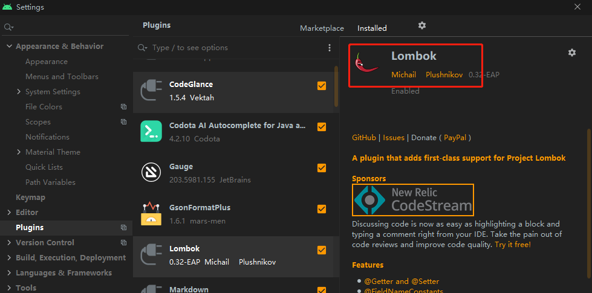
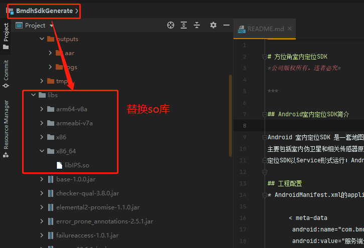
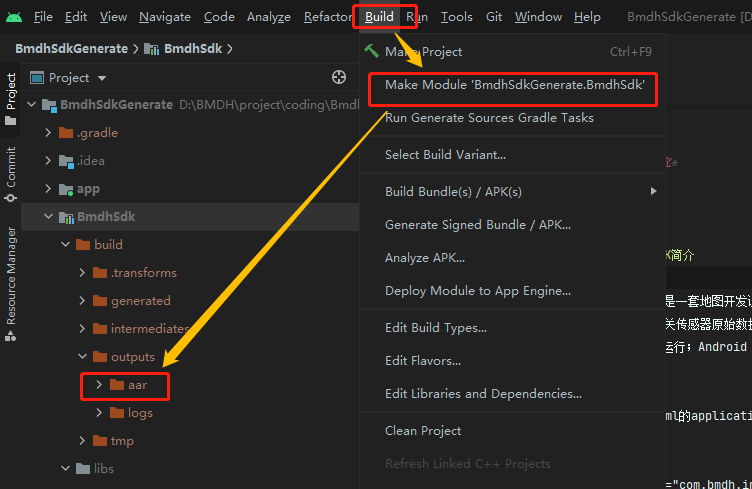

# 方位角室内定位SDK
*公司版权所有，违者必究*

***
## 安装插件 Lombok

## 替换so库

## 生成AAR包

***
## Android室内定位SDK简介

Android 室内定位SDK 是一套地图开发调用接口，开发者和使用者可以轻松地在自己的Android应用获取室内定位位置服务相关的功能，
主要包括室内伪卫星和相关传感器原始数据获取和处理，室内定位位置计算（算法JNI定义、算法实现），室内定位位置返回等；
定位SDK以Service形式运行；Android 室内定位SDK，支持搭载Android 8.0以上手机设备。
  
## 工程配置
* AndroidManifest.xml的application标签下添加服务端下发的APIKey

      < meta-data
       android:name="com.bmdh.indoorsdk.API_KEY"
       android:value="服务端分配的Key(根据用户填写的SHA1值和包名生成)" />
       
* AndroidManifest.xml添加服务

      < service
          android:name="com.indoor.position.IndoorPositionService"
          android:enabled="true"
          android:exported="true">
      </service>
    
* AndroidManifest.xml添加权限
主要有：蓝牙权限，定位权限，传感器权限
manifest.xml需要添加权限

      < uses-permission android:name="android.permission.BLUETOOTH" />
      < uses-permission android:name="android.permission.BLUETOOTH_ADMIN" />
      < uses-permission android:name="android.permission.ACCESS_COARSE_LOCATION" />
      < uses-permission android:name="android.permission.ACCESS_FINE_LOCATION" />

* 如缺少依赖可以build.gradle增加

    implementation 'com.google.guava:guava:30.1.1-jre'

## 对外暴漏的接口
### SDK初始化
    /**
     * 初始化SDK环境，
     *
     * @param context 环境上下文
     * @param bmdhIndoorConfig 使用默认值则传入BmdhIndoorConfig.DEFAULT
     */
    public void init(Context context, BmdhIndoorConfig bmdhIndoorConfig)

* 鉴权数据格式定义：
>（SHA1码+包名方式注册获取），后台设计管理页面类似百度地图SDK控制台*

*  配置文件下载：
>涉及字段（坐标转换等配置数据），mapid和地图的对应关系【网页形式和离线对应关系（北冥导航应用使用）】
哪些经纬度里面有室内地图，确定的经纬度与地图的对应关系，不确定的是与确定地图经纬度X米远的距离的范围内提示有室内地图；

*  日志上传的格式定义：
>涉及字段（appid,uuid,mapid,fnum,isIndoor,当前经纬度，出入口蓝牙设备的唯一码，json(坐标位置信息)），该时机加上日志上传

* 给用户自定义室SDK的配置:
> 初始化配置设置和获取当前的扫描频率[默认为1s扫描一次，可用户定义]，坐标转换配置项的初始化；.
用户可自定义的配置项传入进行初始化，如配置文件的路径指定，蓝牙扫描频率，特定的蓝牙配置数据（蓝牙名称和配置文件名称）用于匹配是否是用户指定的蓝牙；
作用：进行APIKey认证,配置文件下载初始化

### 开启室内定位SDK检测
    /**
     * 开启室内定位服务
     *
     * @param callback 获取到位置信息后的回调，1s回调一次
     */
    public void startIndoorLocation(IPSMeasurement.Callback callback)

### 室内外状态发生改变时的回调
     /**
     * 对当前室内外环境改变，当前室内楼层改变，已经服务断开了的监听
     *
     * @param listener 监听器
     */
    public void setIndoorOrOutdoorChangedListener(IBmdhNaviManager.INaviIndoorStateChangeListener listener){

    }

作用：给用户自定义监听的逻辑，如切换室内外地图、换地图楼层，该时机加上日志上传

### 当前是否为支持室内的定位的环境；
    isCurrentIndoor()
  作用：作为用户室内外地图切换的时机点

### SDK在Activit或Fragment的各个生命周期调用
    涉及方法：onCreate()，onResume()，onPause()，onStop()，onDestroy()
  作用：做不同的设置，比如蓝牙扫描频率,减少内存消耗
    
### 获取SDK版本；
    getSDKVersion()
  作用：跟踪统计各版本遇到的问题

### 退出SDK
      /**
       * 销毁当前SDK资源
       */
      public void exitSDK(){

      }

作用：进行一些资源的销毁

